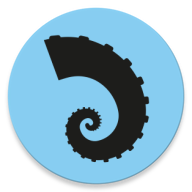

<h1 align="center">Recipes</h1>

  
Recipes is a simple demo app based on modern Android application tech-stacks and CLEAN architecture.

   

## Tech stack & Open-source libraries

- ViewBinding - Allows to more easily write code that interacts with views.
- ViewModel - State Holder. Responsible for the production of UI state, contains the necessary logic for that task.
- Navigation - In-app navigation.
- SafeArgs - Passing data while navigating between fragments.
- Room - Database.
- Dagger-Hilt - Dependency injection.
- Glide - Image loading.
- Kotlin Coroutines -
- Kotlin Flows - 
- Retrofit2 & OkHttp3 - REST API consumption.
- GSON - Deserialization of the returned JSON to Kotlin data objects.
- Timber - Logs.

## Architecture:

- CLEAN Architecture
- MVVM Architecture

## Features

## Preview

## MAD Scorecard

## API

Recipes uses the TheMealDB API. Obtain your API_KEY [TheMealDB](https://www.themealdb.com/api.php) and paste it to the gradle.properties file to try the app.

