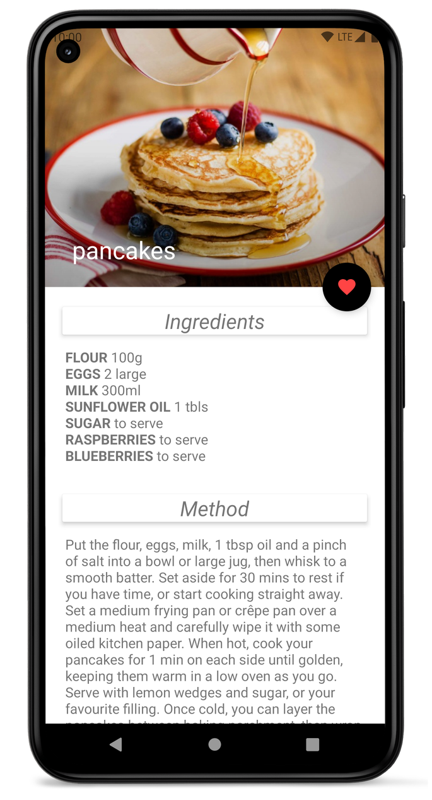
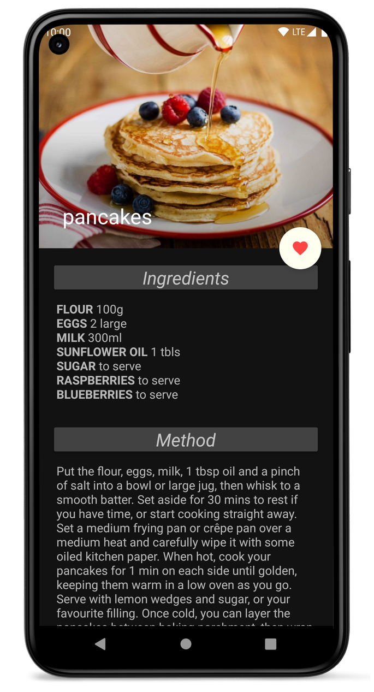
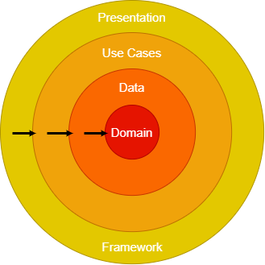

<h1 align="center">Recipes</h1>

  
Recipes is a simple demo app based on modern Android application tech-stacks and CLEAN architecture.

   

## Tech stack & Open-source libraries

- ViewBinding - Allows to more easily write code that interacts with views.
- ViewModel - State Holder. Responsible for the production of UI state, contains the necessary logic for that task.
- Lifecycle - Lifecycle-aware components.
- Navigation - In-app navigation.
- SafeArgs - Passing data while navigating between fragments.
- Room - Database.
- Kotlin Coroutines - A concurrency design pattern to simplify code that executes asynchronously.
- Kotlin Flows - In coroutines, a flow is a type that can emit multiple values sequentially, as opposed to suspend functions that return only a single value. For example, you can use a flow to receive live updates from a database.
- [Dagger-Hilt](https://dagger.dev/hilt/gradle-setup) - Dependency injection.
- [Glide](https://github.com/bumptech/glide) - Image loading.
- [Retrofit2 & Gson](https://github.com/square/retrofit) - REST API consumption.
- [OkHttp3](https://github.com/square/okhttp) - Implementing interceptor and mocking web server.
- [Google Play Services Location](https://developers.google.com/android/guides/setup) - Fused location provider.
- [Timber](https://github.com/JakeWharton/timber) - A logger with a small, extensible API which provides utility on top of Android's normal Log class.
- [SpinKit](https://github.com/ybq/Android-SpinKit) - Loading animations.
- [Shimer](https://github.com/facebook/shimmer-android) - To add a shimmering effect to any view.
- [Material-Components](https://github.com/material-components/material-components-android) Modular and customizable Material Design UI components for Android.
- [Mockito](https://github.com/mockito/mockito-kotlin) - Mocking framework for unit tests.
- [Leakcanary](https://square.github.io/leakcanary/getting_started/) - A memory leak detection library.

## Architecture
#### CLEAN Architecture

  

#### MVVM Architecture & Repository Pattern

 

#### Single Source Of True & Off-line mode

 

## Features
- ViewPager2 + TabLayout
  - Fragment 1 - Bookmarked recipes.
  - Fragment 2 - Search recipes by name.
  - Fragment 3 - Search recipes by country if ACCESS_COARSE_LOCATION permission granted.

- [Single source of truth (Room)](https://developer.android.com/jetpack/guide/data-layer#source-of-truth)
- [Unidirectional Data Flow](https://developer.android.com/jetpack/guide/ui-layer#udf)
- [Error handling (Result<T>)](https://developer.android.com/jetpack/guide/data-layer#expose-errors)
- Off-line mode
- [User events in ItemUIState](https://developer.android.com/jetpack/guide/ui-layer/events?continue=https%3A%2F%2Fdeveloper.android.com%2Fcourses%2Fpathways%2Fandroid-architecture%23article-https%3A%2F%2Fdeveloper.android.com%2Fjetpack%2Fguide%2Fui-layer%2Fevents#recyclerview-events)
- [Fragment constructor injection with FragmentFactory + Hilt](https://medium.com/supercharges-mobile-product-guide/fragmentfactory-with-dagger-and-hilt-31ee17babf73#14ad)
- CollapsingToolbarLayout
- Day/Night theme
- Orientation changes support
- Multi-module project. One module per CLEAN Architecture layer.
- Unit Tests with Flow
- UI Tests
  - Navigation
  - Drawable changes
  - Fragments with FragmentFactory + Hilt

## Preview

## MAD Scorecards

## API

Recipes uses the TheMealDB API. Obtain your API_KEY [TheMealDB](https://www.themealdb.com/api.php) and paste it to the gradle.properties file to try the app.
